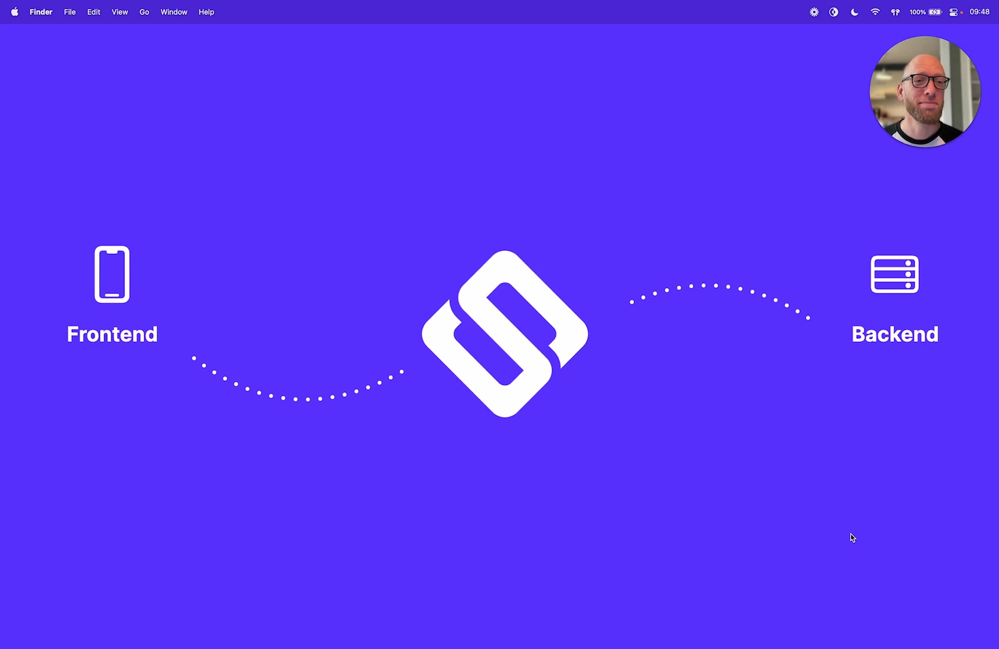

<div align="center">
  
  <p>
    Pronounced as <em>fee · row</em>, a play on "hero" and "pheromone" (that stuff some animals use to act as one).
  </p>
</div>

---

Phero is the no-hassle and type-safe glue between your backend and frontend. TypeScript is at the core of it all. Development with Phero goes in these steps:

1. **Build your backend.** Define your domain models and functions in regular, plain TypeScript.
2. **Run the CLI.** This runs the server and generates an SDK for your frontend, or multiple frontends at the same time.
3. **Call your backend-functions from the frontend, as if they were local.** This includes type-safety and error-handling.

This boosts your frontend development:

💪 Use functions and domain models on the frontend, defined on the backend.  
🧨 Handle errors on the frontend, thrown by the backend.  
🤝 Stop assuming data is of the type you’re expecting. You know it is, period.  
✅ No more mistakes with the specs of the API, like path, arguments or headers.  

Backend development becomes a breeze as well:

🫶 Use TypeScript to define your domain models. No need for an extra language or DSL to learn and maintain, like with GraphQL or tRPC.  
📋 Know when you break compatability with the frontend, before even running it: TypeScript has your back.  
😶‍🌫️ No more outdated specs or documentation about endpoints (and what method, headers or arguments they expect).  
🚀 The server can be deployed anywhere, either on one of the cloud platforms or a regular Node server.  

Check out this introduction video to see how the basics work:

[](https://www.youtube.com/watch?v=I13TKes7ylg)

## Example: Hello World!

It all starts with a file called `src/phero.ts` on your backend. Here's an example:

```ts
import { createService } from "@phero/server"

interface HelloMessage {
  text: string
}

async function sayHello(name: string): Promise<HelloMessage> {
  return {
    text: `Hello, ${name}`,
  }
}

export const exampleService = createService({
  sayHello,
})
```

You can use any database or library you want, because this is a regular NodeJS environment. You can also structure your project in a way you prefer, as long as the Phero-file exports one or more services. Feel free to use any simple or advanced TypeScript feature to model out your domain and functions. In this example we'll keep it at a single service, exposing a function that returns a plain object.

Now, run `npx phero` in your project directory. Phero will generate an SDK for your frontend, in a file called `phero.generated.ts`. This includes a `PheroClient` class which you can use to call the functions on your backend. From the generated file you can also import your models, which could come in very handy in some cases.

Here's an example of how that could look on your frontend:

```ts
import unfetch from "isomorphic-unfetch"

// Phero will generate a file called 'phero.generated.ts` with
// the PheroClient and the models you're using in your functions
// on the backend:
import { PheroClient, HelloMessage } from "../phero.generated"

// instantiate the PheroClient with your favorite fetch lib:
const phero = new PheroClient(unfetch)

// call your function on the backend. The return type of `sayHello` 
// is `Promise<HelloMessage>`, like it would be with a local function:
const helloMessage = await phero.exampleService.sayHello("Steve Jobs")
console.log(helloMessage.text)
```

### Error handling

If `sayHello` acts like a local function, you'd expect you could throw a custom error on the backend, and catch it on the frontend, right? With Phero, you can. Let's say we want to check for a minimum of 3 characters for the person we want to greet:

```ts
class NameTooShortError extends Error {
  constructor(public readonly minimumLength: number) {
    super()
  }
}

async function sayHello(name: string): Promise<HelloMessage> {
  if (name.length < 3) {
    throw new NameTooShortError(3)
  }
  return {
    text: `Hello, ${name}`,
  }
}
```

To catch it on the frontend, you can import the error and handle it like you would with a local function:

```ts
import { HelloMessage, NameTooShortError } from "../phero.generated"

try {
  const helloMessage = await phero.exampleService.sayHello(
    "", // oops!
  )
} catch (error) {
  if (error instanceof NameTooShortError) {
    alert(
      `Name is too short, it should be at least ${error.minimumLength} characters`,
    )
  } else {
    alert("Something went wrong")
  }
}
```

## Documentation

A complete set of documentation could be found at: [docs.phero.dev](https://docs.phero.dev/).

## Status

- [x] Alpha: We are developing and using Phero in projects for our own clients. The toolkit is used in production (in a couple of high-profile apps), but the developer experience may not be optimal.
- [x] Public Alpha: Developer experience is stable and most common TypeScript-types should be supported.
- [x] Public Beta: Advanced TypeScript-types are supported, but some platform-specific features may be missing.
- [ ] Public: Feature-complete and running everywhere!

We are currently in Public Beta. Watch "releases" of this repo to get notified of major updates!

## Community & Support

- [GitHub Issues](https://github.com/phero-hq/phero/issues): Bugs, errors or feature-requests can be posted here.
- [GitHub Discussions](https://github.com/phero-hq/phero/discussions) or [Discord](https://discord.gg/t97n6wQfkh): You are very welcome to hang out, ask questions, show what you've build, or whatever!
- [Twitter](https://twitter.com/PheroHQ): Another place to keep up to date with announcements and news.
- [YouTube](https://www.youtube.com/channel/UCgHc6KiLud3FAL_Pecb3pnQ): Here we'll be posting our guides in video-form.

## License

Phero is [licensed as Apache-2.0](https://www.apache.org/licenses/LICENSE-2.0).
